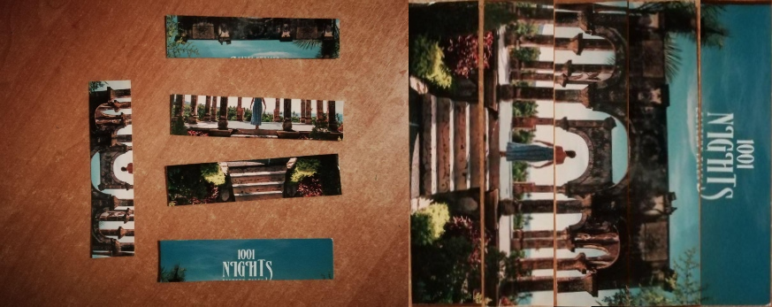
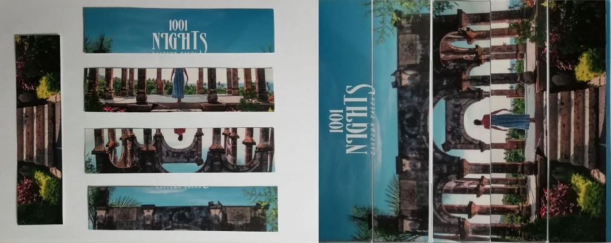

# Anti-Shredder
This program automatically assembles a picture from strips of paper. It's better to take photos of strips on a white or bright background.

## Examples





## Setup

```bash
mkdir build
cd build
cmake ..
make
```

## Getting Started

In the project directory:

```bash
./bin/main path_to_the_input_image
```